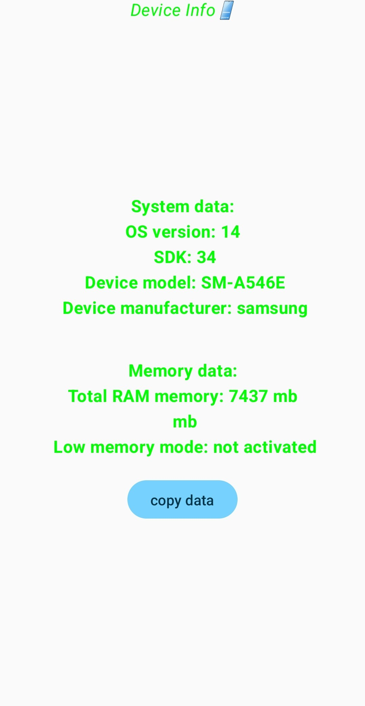

# DeviceInfo

### Simple application for taking 📱device info.

📱Device Info a simple application that allows you to view some of the phone's system data

## 🌟Features

- View system data(`OS version`, `sdk int`, `device model`, `device manufacturer`)⚙️
- View memory data(`total RAM memory`, `low memory mode state`)💿
- Copy device data to clipboard by button click📃

## 🖼️Preview

