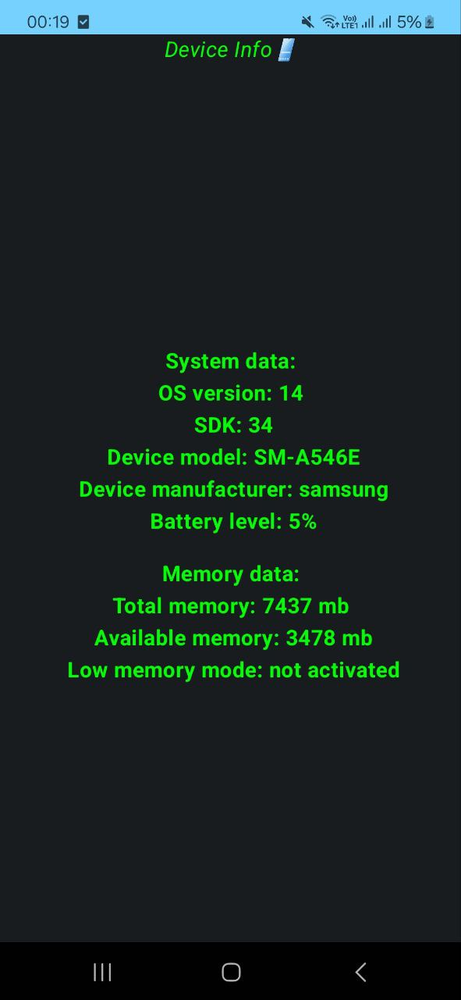

# DeviceInfo

### Simple application for taking 📱device info.

📱Device Info a simple application that allows you to view some of the phone's system data

## 🌟Features

- View system data(OS version, sdk int, device model, device manufacturer, battery level).
- View memory data(total memory, available memory, low memory mode)

